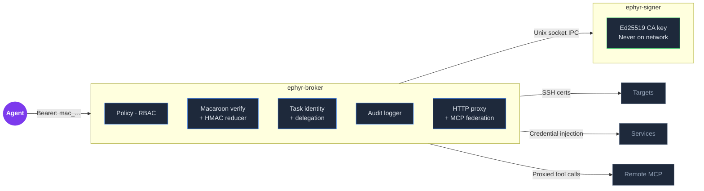

# Ephyr

*pronounced "eh-feer"*

**Cryptographically bounded agent authority with centralized audit.**

The first open-source implementation of the Delegation Capability Token (DCT) architecture proposed in Google DeepMind's ["Intelligent AI Delegation"](https://arxiv.org/abs/2602.11865) framework (February 2026).

[](#quick-start)
[](#license)
[](https://github.com/EphyrAI/Ephyr/actions)

---

## The Problem

MCP gives AI agents access to tools. It does not govern what happens when agents delegate to sub-agents, when permissions need to attenuate across delegation chains, or when every action needs to be correlated back to the task that initiated it. Static credentials -- SSH keys, API tokens, service accounts -- don't expire, can't be scoped per-task, and persist after the agent session ends.

When agent A delegates to agent B, and B delegates to C, the question is: **who authorized C to do what, and can you prove the authority only narrowed?**

## What Ephyr Does

Ephyr is an access broker that sits between AI agents and infrastructure. It replaces scattered credentials with a single MCP endpoint that enforces policy, issues ephemeral certificates, and produces SIEM-ready structured audit logs. Every action is scoped to a task, time-bounded, and cryptographically traceable through the delegation chain.

- **HMAC-chained macaroon tokens** make restriction removal cryptographically impossible. The broker's effective envelope reducer derives the most-restrictive authority from accumulated caveats using set intersection, minimums, and boolean AND. Capabilities can only narrow across delegation hops.
- **Epoch watermark revocation** invalidates an entire task tree instantly -- revoking a parent cascades to all descendants with O(depth) validation and no per-token blocklists.
- **Centralized audit with ULID correlation** ties every SSH command, HTTP proxy request, and MCP federation call back to its originating task tree. "What happened during this deployment?" is a single query.
- **Three proxy paths through one endpoint** -- SSH certificates, HTTP APIs with credential injection, and federated MCP servers. Agents connect once; the broker handles authentication, authorization, and proxying.

## How It Works



<details>
<summary>View as text</summary>

```
                          +---------------------+
                          |   ephyr-broker      |
  +-----------+           | +-----------------+ |           +---------------+
  |   Agent   |--Bearer-->| | Policy / RBAC   | |--SSH----->|   Targets     |
  +-----------+  mac_...  | | Macaroon verify | |  certs    +---------------+
                          | | Task identity   | |
                          | | Audit logger    | |           +---------------+
                          | | HTTP proxy +    | |--Cred---->|   Services    |
                          | |   MCP federation| |  inject   +---------------+
                          | +-----------------+ |
                          +--------+------------+           +---------------+
                                   |                 ------>|  Remote MCP   |
                          Unix socket IPC            proxy  +---------------+
                                   |
                          +--------+------------+
                          |   ephyr-signer      |
                          | +-----------------+ |
                          | | Ed25519 CA key  | |
                          | | Never on network| |
                          | +-----------------+ |
                          +---------------------+
```

</details>

**ephyr-signer** holds the Ed25519 CA private key in a systemd sandbox with `ProtectSystem=strict`, `MemoryDenyWriteExecute`, and zero capabilities. Unix socket IPC only. The CA key never leaves this process, never touches the network.

**ephyr-broker** handles everything else: HMAC chain verification, caveat reduction, policy evaluation, SSH certificate requests via signer IPC, HTTP proxy with credential injection, MCP federation, task tree management, structured audit logging, and the admin dashboard.

## Capability Tiers

Ephyr evolves through three tiers. Each is a strict superset of the previous.

### Ephyr Core (v0.1 -- v0.2a)

The foundational broker.

- **One connection, all access** -- SSH, HTTP APIs, and remote MCP servers through a single MCP endpoint
- **Ephemeral credentials** -- SSH certificates default to 5-minute TTL. Service and MCP grants auto-expire.
- **No standing backend credentials** -- the broker injects tokens, certificates, and auth headers. Agents never handle long-lived secrets directly.
- **Declarative policy** -- YAML defines who can access what, with what role, for how long. Hot-reload with SIGHUP.
- **Task-scoped identity** -- every action correlates to a task run with a ULID. Tiered trust: signer holds root CA, broker operates with short-lived delegated signing authority.
- **Epoch watermark revocation** -- revoking a task instantly invalidates all descendants without per-token tracking.
- **Full audit trail** -- every certificate, command, HTTP proxy request, and denied action. Structured JSON, ready for your SIEM.

#### What Ephyr Core does NOT provide

- Command-level filtering at the broker (the broker issues certificates; command restriction is enforced by target host shell and sudoers)
- Push-revocation of SSH certificates to target hosts (OpenSSH does not support online CRL for user certificates; TTL is the mitigation)
- Multi-tenant isolation (single policy file, single CA; deploy separate instances for tenant boundaries)

### Ephyr Delegation (v0.2b)

Delegated task authority for multi-agent workflows. Implements the Delegation Capability Token architecture from DeepMind's "Intelligent AI Delegation" (arXiv:2602.11865).

- **Macaroon-based task tokens** -- HMAC-chained caveats make restriction removal cryptographically impossible. The HMAC chain proves caveat accumulation; the reducer derives semantic narrowing.
- **Broker-mediated delegation** -- parent tasks delegate to children with attenuated scope. The broker mediates every delegation for audit and pre-validation.
- **Effective envelope reducer** -- set intersection, minimums, and boolean AND derive the most-restrictive authority from accumulated caveats.
- **Cross-agent delegation** -- one agent can delegate to another with reduced scope. The child gets the intersection of parent ceiling and child policy.
- **Lineage-aware audit** -- full task trees with ULID correlation. "What happened during this deployment?" is a single query.

#### What Ephyr Delegation does NOT provide

- Cryptographic proof of semantic attenuation. The correct claim: cryptographic proof of caveat accumulation (HMAC chain) combined with deterministic semantic narrowing (reducer). Caveats accumulate; the reducer interprets them.
- Holder binding. Task tokens are bearer tokens. A leaked macaroon can be used by anyone until it expires or is revoked. TTL and epoch watermark mitigate this; Ephyr Bind addresses it.

### Ephyr Bind (v0.3)

Holder-bound tokens and replay resistance.

- **Proof-of-possession** -- each request proves the presenter controls a private key bound to the token. Leaked macaroons are useless without the key.
- **DPoP-style request signing** -- works over existing HTTP/MCP transport, no mTLS infrastructure required.

## Features

### MCP Server (16 Tools)

JSON-RPC 2.0 over Streamable HTTP, implementing [MCP 2025-03-26](https://modelcontextprotocol.io/). Sixteen tools (9 core + 7 task identity) plus federated tools from remote servers.

**Core Tools:**

| Tool | Description |
|------|-------------|
| `list_targets` | Discover available SSH hosts and permitted roles |
| `exec` | Run a command on a target via ephemeral SSH certificate |
| `session_create` | Open a persistent SSH session (60x faster for sequential commands) |
| `session_close` | Close a persistent SSH session |
| `list_sessions` | List active persistent SSH sessions |
| `list_certs` | List active certificates for this agent |
| `http_request` | Make an HTTP request through the credential-injecting proxy |
| `list_services` | List available HTTP proxy services |
| `list_remotes` | List federated remote MCP servers and their tools |

**Task Identity Tools:**

| Tool | Description |
|------|-------------|
| `task_create` | Create a task and receive a macaroon-based task token with capability envelope |
| `task_delegate` | Delegate a child task with attenuated capabilities (macaroon with added caveats) |
| `task_info` | Get task details, status, and lineage |
| `task_list` | List active tasks for this agent |
| `task_revoke` | Revoke a task and all its tokens via epoch watermark (cascading to children) |
| `task_bind` | Bind a task token to a holder key for proof-of-possession (Ephyr Bind) |

**Federated Tools:**

| Tool | Description |
|------|-------------|
| *`{server}.{tool}`* | Dynamically discovered tools from remote MCP servers (e.g., `devtools.list_repos`) |

**Resources** (agent self-discovery):

| URI | Description |
|-----|-------------|
| `ephyr://overview` | System summary, available targets, services, and agent permissions |
| `ephyr://targets` | SSH targets with hosts, ports, roles, and auto-approve status |
| `ephyr://services` | HTTP proxy services with credential injection details |
| `ephyr://roles` | Role definitions and SSH principal mappings |
| `ephyr://status` | Agent's active certificates, sessions, and recent activity |
| `ephyr://tools` | Quick reference for all MCP tools with parameters |
| `ephyr://remotes` | Federated MCP servers with connection status and available tools |

### SSH Certificate Authority

Ed25519 CA issuing ephemeral, per-request certificates. Default TTL is 5 minutes, configurable up to 30 minutes per-target. Each certificate is scoped to a specific agent, target, and role. Duplicate certificates for the same agent+target+role are automatically revoked when a new one is issued.

Persistent sessions reduce per-command latency from ~850ms to ~14ms for sequential operations.

### Task-Scoped Identity and Delegation

Agents create tasks via `task_create` and receive a macaroon-based task token. The token carries:

- **Task ID** -- ULID (lexicographically sortable, encodes creation time)
- **Capability envelope** -- Upper-bound permissions (targets, roles, services, remotes, methods) resolved from RBAC policy at creation time
- **Lineage** -- Parent task reference for sub-task delegation

**Delegation with attenuation:** Parent tasks created with `can_delegate: true` can spawn child tasks via `task_delegate`. Children receive macaroons with additional caveats that further restrict the capability envelope. The HMAC chain guarantees caveats cannot be removed. Maximum chain depth is 5. Child TTL cannot exceed parent's remaining TTL.

**Dual-mode authentication:** The broker accepts both macaroon tokens (prefixed `mac_`) and legacy JWT/API key authentication for backward compatibility.

**Tiered trust model:** The signer issues delegation certificates to the broker. The broker signs task tokens locally using its delegation key -- no IPC round-trip per token. Delegation keys auto-rotate before expiry.

**Epoch watermark revocation:** `task_revoke` invalidates all tokens for a task by setting an epoch timestamp. Validation checks the watermark in O(depth) with no per-token blocklists. Cascading revocation propagates to all child tasks in the lineage.

**Bearer-token limitation:** Task tokens (both JWT and macaroon) are bearer tokens. A leaked token can be used by anyone until TTL expiry or epoch watermark revocation. Ephyr Bind (v0.3) will add holder binding via proof-of-possession.

### HTTP Proxy with Credential Injection

A generic authenticated proxy for web services. Configure a service once with its URL prefix and credentials, and agents make requests without ever seeing the token. Supports bearer, basic auth, custom header, and query parameter injection. Network policy controls reachable destinations.

Works with internal services (Gitea, Grafana, Portainer) and external APIs (GitHub, cloud providers). Services can be individually enabled/disabled via the dashboard.

### MCP Federation

Aggregate tools from remote MCP servers through a single unified endpoint. The broker discovers tools automatically via MCP handshake, exposes them namespaced (e.g., `devtools.list_repos`), and proxies calls transparently with credential injection. Background refresh keeps catalogs current.

### Policy Engine

Declarative YAML with hot-reload via SIGHUP. Eight-step evaluation pipeline for every certificate request: agent exists, target exists, role allowed, duration clamped, concurrent limits, duplicate handling, global limits, approval mode. Every denial includes a specific reason.

### RBAC -- Per-Agent Permissions

Fine-grained, per-agent access control across all three proxy paths (SSH, HTTP, MCP federation) and the dashboard. Template inheritance, wildcard support, and agent-level overrides. Backwards-compatible legacy mode for agents without RBAC fields.

| Layer | What it checks |
|-------|----------------|
| SSH exec | Agent's roles for the target, intersection with target's `allowed_roles` |
| HTTP proxy | Agent's allowed services and permitted HTTP methods |
| MCP federation | Agent's allowed remotes and optional tool restrictions |
| Discovery | Filters `list_targets`, `list_services`, `list_remotes` results |
| Dashboard | Agent's dashboard access level (none/viewer/operator/admin) |

### Prometheus Metrics

`GET /v1/metrics` endpoint in Prometheus exposition format. Lock-free atomic counters and latency histograms.

**Latency histograms** (7 buckets: <100us, <500us, <1ms, <5ms, <10ms, <50ms, >50ms):

| Metric | Description |
|--------|-------------|
| `ephyr_token_sign_seconds` | Token signing latency |
| `ephyr_token_validate_seconds` | Token validation latency |
| `ephyr_watermark_check_seconds` | Watermark revocation check latency |
| `ephyr_envelope_check_seconds` | Capability envelope check latency |
| `ephyr_policy_eval_seconds` | Policy evaluation latency |
| `ephyr_ssh_cert_seconds` | SSH certificate signing latency |
| `ephyr_delegation_ipc_seconds` | Delegation IPC latency |
| `ephyr_exec_e2e_seconds` | End-to-end exec latency |

**Counters and gauges:**

| Metric | Type | Description |
|--------|------|-------------|
| `ephyr_tasks_created_total` | counter | Total tasks created |
| `ephyr_tasks_active` | gauge | Currently active tasks |
| `ephyr_tokens_signed_total` | counter | Total tokens signed |
| `ephyr_tokens_validated_total` | counter | Total tokens validated |
| `ephyr_tokens_rejected_total` | counter | Total tokens rejected |
| `ephyr_tokens_delegated_total` | counter | Total delegation tokens issued |
| `ephyr_watermark_revocations_total` | counter | Total watermark revocations |
| `ephyr_delegation_rotations_total` | counter | Total delegation cert rotations |
| `ephyr_legacy_requests_total` | counter | Requests without task token (legacy mode) |
| `ephyr_auth_cache_hits_total` | counter | Auth cache hits (bcrypt bypassed) |
| `ephyr_auth_cache_misses_total` | counter | Auth cache misses (bcrypt required) |
| `ephyr_macaroon_minted_total` | counter | Macaroons minted |
| `ephyr_macaroon_verified_total` | counter | Macaroons verified |

### Auth Cache

SHA-256 keyed bcrypt result cache with configurable TTL. Eliminates redundant bcrypt verification on repeated MCP requests from the same agent.

| Metric | Value |
|--------|-------|
| Cold auth (bcrypt) | ~216ms |
| Warm auth (cache hit) | <1ms |
| Speedup | 187x |
| Default TTL | 60 seconds |
| Configuration | `EPHYR_AUTH_CACHE_TTL` env var |
| Disable | `EPHYR_AUTH_CACHE_TTL=0` or `off` or `false` |

### Dashboard

Single-page admin UI with eleven views across four groups:

- **OVERVIEW:** System summary, stat cards, host/service/MCP panels with toggles, active sessions, live event feed
- **INFRASTRUCTURE:** Hosts, Services, MCP Servers -- enable/disable toggles, configuration panels
- **MONITOR:** Agents, Activity, Sessions, Audit Log, Tasks (table/tree view, envelope inspector, cascade revocation)
- **TOOLS:** Terminal (WebSocket SSH proxy), Settings

Key operational controls: policy inspection, emergency certificate revocation, remote enable/disable without restart, audit log search. WebSocket live event streaming.

### Security Hardening

- **Unix socket authentication** -- `SO_PEERCRED` extracts the caller's UID from the kernel
- **Constant-time token comparison** -- `crypto/subtle` prevents timing attacks
- **Systemd sandboxing** -- `ProtectSystem=strict`, `NoNewPrivileges`, `MemoryDenyWriteExecute`, zero capabilities
- **CA key isolation** -- Private key exists only in the signer process; broker never reads it
- **Network isolation** -- nftables drops direct agent-to-backend traffic
- **Delegation separation** -- Broker signs task tokens with a delegated key, not the CA key
- **Epoch revocation** -- No per-token blocklists; watermark-based invalidation in O(depth)

## Performance

Benchmarked on a Debian 12 LXC (1 vCPU, 512MB RAM):

| Operation | Latency | Notes |
|-----------|---------|-------|
| Auth (cold, bcrypt) | ~216ms | First request per API key |
| Auth (warm, cached) | <1ms | Subsequent requests within TTL (187x speedup) |
| Macaroon mint | ~34us | HMAC-SHA256 chain construction |
| Macaroon verify | ~32us | HMAC chain + reducer evaluation |
| Token signing (JWT) | <1ms | Ed25519 local signing via delegation key |
| Token validation (JWT) | <1ms | Signature + envelope + watermark check |
| SSH exec (new cert) | ~850ms | Full cert issuance + SSH connection |
| SSH exec (session) | ~14ms | Persistent session reuse (60x faster) |

## Security Boundaries

### What Ephyr enforces

- **Access issuance policy** -- Which agents can reach which targets, with which roles, for how long
- **Task-scoped identity** -- Capability envelopes bound what a token can do; watermark revocation invalidates instantly
- **Request-level audit** -- Every action logged with agent identity, target, timestamp, outcome, and task correlation
- **Credential isolation** -- Backend credentials live in the broker/signer processes; agents never receive long-lived secrets
- **Grant expiry** -- All access is time-limited with automatic cleanup

### What Ephyr does NOT enforce

- **Command-level permissions** -- Ephyr controls *who* gets access and *for how long*. The target host controls *what they can do*. SSH principals map to Linux users whose capabilities are defined by shell choice, sudoers rules, and filesystem permissions. **A misconfigured target host silently negates the security model.** See [Target Setup](docs/target-setup.md) and [T18 in the Threat Model](docs/THREAT_MODEL.md).
- **OS-level isolation** -- SELinux/AppArmor, filesystem permissions, and host network policy are outside Ephyr's scope
- **Holder binding (until Bind ships)** -- Task tokens are bearer tokens. TTL and epoch watermark mitigate replay; proof-of-possession is planned for Ephyr Bind.

### Threat model

- Broker compromise does not expose the CA key (signer is a separate process)
- Host compromise can abuse active grants within TTL only (default 5 minutes)
- Network isolation is defense-in-depth, not a substitute for host hardening
- See [docs/THREAT_MODEL.md](docs/THREAT_MODEL.md) for 14 enumerated threats with mitigations

## Quick Start

Get Ephyr running in under 5 minutes.

### Option A: Docker (fastest)

```bash
git clone https://github.com/EphyrAI/Ephyr.git
cd Ephyr

# Generate a CA key
./examples/generate-ca-key.sh

# Start signer + broker
docker compose up --build -d

# Verify — should return {"jsonrpc":"2.0",...,"serverInfo":{"name":"ephyr"}}
curl -s http://localhost:8554/mcp \
  -H "Authorization: Bearer ephyr-demo-key" \
  -H "Content-Type: application/json" \
  -d '{"jsonrpc":"2.0","id":1,"method":"initialize","params":{"protocolVersion":"2025-03-26","capabilities":{},"clientInfo":{"name":"test","version":"1.0"}}}'
```

Dashboard at `http://localhost:8553` (default port, token: `changeme`). Edit `examples/policy.yaml` to add your targets.

### Option B: Native install (Linux)

```bash
git clone https://github.com/EphyrAI/Ephyr.git
cd Ephyr

# One command: build, install, create user, generate CA key, write
# example policy, install systemd units, start services.
sudo make setup
```

Requires Go 1.24+ and systemd. Customize with:
```bash
sudo make setup DASHBOARD_TOKEN=mysecret MCP_PORT=9000 DASHBOARD_PORT=9001
```

Output shows the dashboard URL, MCP endpoint, and demo API key. Edit `/etc/ephyr/policy.yaml` to add your targets.

### 3. Configure target hosts

Each SSH target needs role accounts and the broker's CA public key. Run the provisioning script on each target:

```bash
scp /etc/ephyr/ca_key.pub deploy/scripts/provision-target.sh root@TARGET:/tmp/
ssh root@TARGET "bash /tmp/provision-target.sh /tmp/ca_key.pub"
```

This creates `agent-read` (restricted shell), `agent-op` (bash + limited sudo), and `agent-admin` (bash + broader sudo), configures sshd to trust Ephyr certificates, and installs sudoers rules. See [docs/target-setup.md](docs/target-setup.md) for custom roles and manual setup.

### 4. Do one thing

```bash
# Run a command on a target via ephemeral SSH certificate
ephyr exec webserver --role read -- hostname
```

The broker generates a keypair, gets it signed by the signer, SSHs to the target, runs the command, and returns the output. The certificate expires in 5 minutes. No SSH keys were deployed.

### 5. Create a task with delegation

```bash
# Create a scoped task — get back a macaroon token
ephyr task create --description "deploy v2.3" --ttl 15m --can-delegate

# Delegate a narrower sub-task
ephyr task delegate --parent <task-id> \
  --description "read-only check" \
  --targets webserver --roles read --ttl 5m

# Inspect the macaroon caveats
ephyr inspect <token>
```

The child token's HMAC chain cryptographically proves the caveats accumulated. The reducer guarantees the child's effective authority is strictly narrower than the parent's.

> For the full architecture — tiered trust, macaroon caveat chains, epoch watermark revocation, and holder-bound tokens — see [docs/architecture.md](docs/architecture.md).

## MCP Integration

Point any MCP-compatible client at the broker. No SDK, no plugin, no agent framework dependency.

### Claude Code

```json
{
  "mcpServers": {
    "ephyr": {
      "type": "url",
      "url": "http://your-broker:8554/mcp",
      "headers": {
        "Authorization": "Bearer YOUR_API_KEY"
      }
    }
  }
}
```

Works with Claude Code, Claude Desktop, Cursor, Cline, OpenClaw, and any MCP-compatible client.

## Roadmap

| Version | Tier | What ships |
|---|---|---|
| **v0.1** | **Core** | Broker foundation: SSH/HTTP/MCP access, policy, audit |
| **v0.2a** | **Core** | Task identity: tiered trust, JWT task tokens, watermarking |
| **v0.2b** | **Delegation** | Macaroon engine: reducer, delegation, inspect CLI |
| **v0.2c** | **Delegation** | Dashboard: task trees, caveat inspector |
| **v0.3** | **Bind** | Proof-of-possession: holder binding, DPoP-style signing |

## Dependencies

Three direct dependencies, all well-established:

| Module | Purpose | Tier |
|---|---|---|
| `github.com/gorilla/websocket` | WebSocket for dashboard and terminal | **Core** |
| `golang.org/x/crypto` | SSH certificates, bcrypt | **Core** |
| `gopkg.in/yaml.v3` | Policy YAML parsing | **Core** |

The macaroon implementation is pure Go stdlib (HMAC-SHA256 from `crypto/hmac`). No external macaroon dependency.

No external databases. No message queues. No container runtime.

## Project Structure

```
ephyr/
├── cmd/
│   ├── broker/         # ephyr-broker entry point
│   ├── ephyr/          # CLI tool (includes `inspect` command)
│   └── signer/         # ephyr-signer entry point
├── internal/
│   ├── audit/          # Structured JSON-line audit
│   ├── auth/           # Session manager, SO_PEERCRED
│   ├── broker/         # Core broker: server, handlers, dashboard, MCP,
│   │                   #   proxy, activity, config, terminal, websocket,
│   │                   #   rate limiter, federation, grant store
│   ├── macaroon/       # Macaroon minting, verification, reducer (Delegation)
│   ├── policy/         # Policy types, YAML loader, evaluation
│   └── signer/         # Certificate signing, CA key, IPC
├── dashboard/          # React 18 SPA
├── deploy/             # systemd units, provisioning scripts, Ansible roles
├── docs/               # Architecture, security, API reference
│   ├── architecture.md
│   ├── security.md
│   ├── THREAT_MODEL.md
│   └── ...
├── CHANGELOG.md
├── CONTRIBUTING.md
├── Makefile
├── go.mod
└── go.sum
```

## Testing

253+ tests across 13+ test files:

- **Unit tests** -- Policy engine, RBAC resolution, delegation, revocation, grants, rate limiting, metrics, token signing/validation, activity store, macaroon minting/verification/reducer
- **Integration tests** -- 12 end-to-end tests (`test/integration/smoke_test.go`) that run against a live Ephyr instance: MCP handshake, tool listing, legacy compatibility, task lifecycle, macaroon delegation, metrics endpoint, and performance benchmarks

```bash
make test                    # Unit tests
make lint                    # golangci-lint
go test ./test/integration/  # Integration tests (requires running instance)
```

## Deployment

| Method | Best for | Guide |
|--------|----------|-------|
| **Docker Compose** | Trying Ephyr, dev/test | [Quick Start](#option-a-docker-fastest) above |
| **Ansible** | Production, multi-host | [deploy/ansible/README.md](deploy/ansible/README.md) |
| **Manual** | Full control, custom setups | [docs/deployment.md](docs/deployment.md) |

## Requirements

- **Go 1.24+** -- uses enhanced routing patterns and recent stdlib features (build from source only)
- **Linux** -- `SO_PEERCRED` for Unix socket peer authentication is Linux-specific
- **Docker 24+** -- for containerized deployment (alternative to building from source)
- **OpenSSH** -- target hosts need `TrustedUserCAKeys` configured
- **systemd** -- recommended for production (manual/Ansible deployment)
- **nftables** -- recommended for network isolation

## Documentation

| Document | Description |
|----------|-------------|
| [Target Setup](docs/target-setup.md) | Configure SSH targets: roles, principals, sudoers |
| [Architecture](docs/architecture.md) | Trust model, delegation chain, validation flow |
| [Security](docs/security.md) | Security boundaries, hardening guide |
| [Configuration](docs/configuration.md) | Full policy reference and RBAC setup |
| [Deployment](docs/deployment.md) | Local, dedicated host, and production scenarios |
| [API Reference](docs/api-reference.md) | Complete REST and MCP API documentation |
| [MCP Integration](docs/mcp-integration.md) | Client setup for Claude Code, Desktop, Cursor, Cline |
| [Threat Model](docs/THREAT_MODEL.md) | 14 enumerated threats with mitigations |

## Contributing

Contributions welcome. The codebase is ~24,000 lines of Go across ~64 files with no code generation and no frameworks -- the standard library plus three dependencies.

```bash
make test    # Run tests
make lint    # Run linter
```

Please open an issue before starting work on large changes.

## License

Apache License 2.0. See [LICENSE](LICENSE) for details.

---

`~24,000 lines of Go | 64 source files | 253+ tests | 3 dependencies | Zero external databases`
