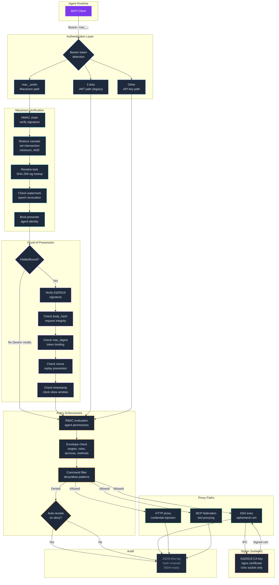
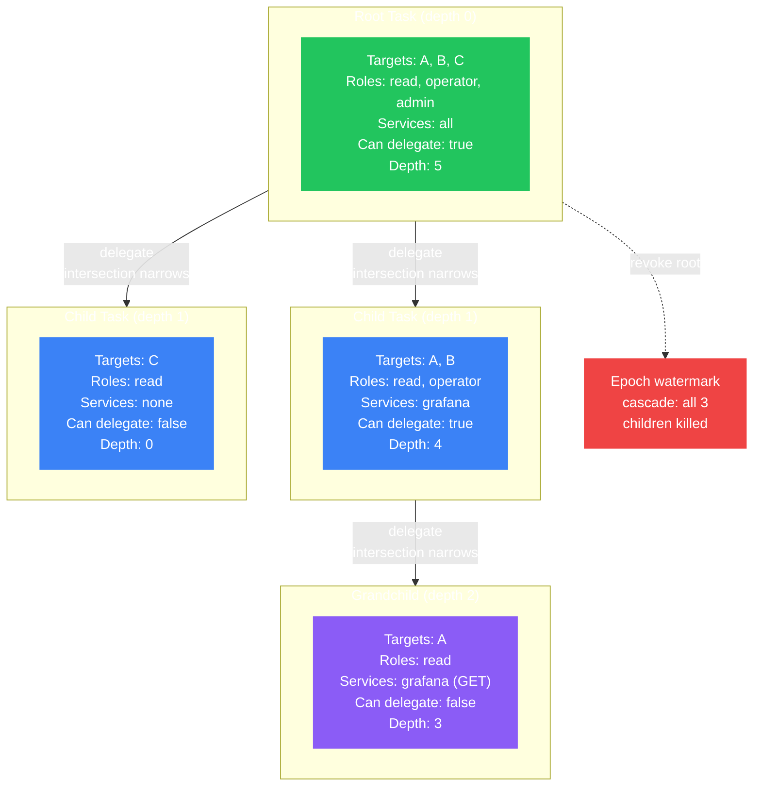

# Ephyr Authorization Framework

## Full Request Lifecycle



<details>
<summary>View as text</summary>

```
Request Flow:

  Agent (MCP Client)
    |
    | Bearer: mac_<base64url>
    v
  +----------------------------------+
  | AUTHENTICATION                   |
  |  mac_ prefix --> Macaroon path   |
  |  3 dots     --> JWT (legacy)     |
  |  other      --> API key (bcrypt) |
  +----------------------------------+
    |
    v (macaroon path)
  +----------------------------------+
  | MACAROON VERIFICATION            |
  |  1. HMAC chain (signature)       |
  |  2. Reduce caveats               |
  |     - set intersection (targets) |
  |     - minimum (depth, TTL)       |
  |     - AND (can_delegate)         |
  |  3. Resolve task (sig digest)    |
  |  4. Check epoch watermark        |
  |  5. Bind presenter (agent)       |
  +----------------------------------+
    |
    v
  +----------------------------------+
  | PROOF-OF-POSSESSION (if bound)   |
  |  1. Ed25519 signature verify     |
  |  2. body_hash (request integrity)|
  |  3. mac_digest (token binding)   |
  |  4. nonce (replay prevention)    |
  |  5. timestamp (clock skew)       |
  +----------------------------------+
    |
    v
  +----------------------------------+
  | POLICY ENFORCEMENT               |
  |  1. RBAC (agent permissions)     |
  |  2. Envelope (targets, roles,    |
  |     services, methods)           |
  |  3. Command filter (deny/allow)  |
  |  4. Auto-revoke on deny?         |
  +----------------------------------+
    |
    +--------+--------+--------+
    v        v        v        v
  SSH      HTTP     MCP     DENIED
  exec     proxy    federation
    |        |        |
    v        |        |
  Signer     |        |
  (CA key)   |        |
    |        |        |
    v        v        v
  +----------------------------------+
  | AUDIT LOG                        |
  |  JSON-line, hash-chained,        |
  |  per-event, SIEM-ready           |
  +----------------------------------+
```

</details>

## Delegation Attenuation



<details>
<summary>View as text</summary>

```
Delegation Tree (envelope shrinks at each level):

  Root Task (depth 0)
  Targets: [A, B, C]  Roles: [read, op, admin]  Services: [*]  Delegate: yes
    |
    +-- Child 1 (depth 1)                        HMAC caveat appended
    |   Targets: [A, B]  Roles: [read, op]       intersection([A,B,C], [A,B]) = [A,B]
    |   Services: [grafana]  Delegate: yes
    |     |
    |     +-- Grandchild (depth 2)                HMAC caveat appended
    |         Targets: [A]  Roles: [read]         intersection([A,B], [A]) = [A]
    |         Services: [grafana, GET]             AND(true, false) = false
    |         Delegate: no
    |
    +-- Child 2 (depth 1)                         HMAC caveat appended
        Targets: [C]  Roles: [read]               intersection([A,B,C], [C]) = [C]
        Services: []  Delegate: no

  Revoke root --> epoch watermark --> all 3 children killed instantly
```

</details>

## Ephyr: Holder Binding (Two-Phase Key Exchange)

```mermaid
sequenceDiagram
    title Ephyr: Holder Binding (Two-Phase Key Exchange)

    participant P as Parent Agent
    participant B as Broker
    participant S as Signer (CA)
    participant C as Child Agent

    rect rgb(30, 41, 59)
    Note over P,B: Phase 1: Delegation
    P->>B: task_delegate(parent_token, child_envelope)
    B->>B: Verify parent macaroon (HMAC chain)
    B->>B: Reduce caveats + validate subset
    B->>B: Mint child macaroon (append narrowing caveats)
    B->>B: Set HolderBound=false, BindDeadline=30s
    B-->>P: Child macaroon (unbound, unusable until bound)
    end

    P->>C: Pass macaroon (out of band)

    rect rgb(30, 41, 59)
    Note over C,B: Phase 2: Key Binding
    C->>C: Generate ephemeral Ed25519 keypair
    C->>B: task_bind(macaroon, public_key)
    B->>B: Verify macaroon (only task_bind allowed for unbound tokens)
    B->>B: Check BindDeadline not expired
    B->>B: Store HolderPubKey, set HolderBound=true
    B-->>C: Bound confirmation
    end

    rect rgb(30, 41, 59)
    Note over C,S: Bound Request (e.g., SSH exec)
    C->>B: exec(target, role, command) + _pop{sig, body_hash, nonce, ts}
    B->>B: Verify macaroon HMAC chain
    B->>B: Reduce caveats to effective envelope
    B->>B: Verify PoP: Ed25519 sig, body_hash, mac_digest, nonce, timestamp
    B->>B: RBAC + envelope authorization
    B->>S: Sign SSH certificate (Unix socket IPC)
    S->>S: Ed25519 CA signs ephemeral cert
    S-->>B: Signed certificate (never on network)
    B->>B: SSH dial with cert to target
    B-->>C: Command output
    end

    Note over P,C: Parent's key cannot present child's token
    Note over P,C: Child's key cannot present parent's token
    Note over S,S: CA key never leaves signer process
```



<details>
<summary>View as text</summary>

```
Ephyr: Holder Binding (Two-Phase Key Exchange)

  Parent              Broker                Signer (CA)       Child
    |                   |                       |                |
    |                   |    PHASE 1: DELEGATION                 |
    |-- task_delegate ->|                       |                |
    |                   |-- verify parent mac    |                |
    |                   |-- reduce + subset     |                |
    |                   |-- mint child mac      |                |
    |                   |-- HolderBound=false   |                |
    |                   |-- BindDeadline=30s    |                |
    |<- child macaroon -|                       |                |
    |                   |                       |                |
    |-- pass token (out of band) ------------------------------>|
    |                   |                       |                |
    |                   |    PHASE 2: KEY BINDING                |
    |                   |                       |  generate key  |
    |                   |<--- task_bind(mac, pubkey) ------------|
    |                   |-- verify mac          |                |
    |                   |-- check deadline      |                |
    |                   |-- store key, bind=true|                |
    |                   |-- confirm ---------------------------->|
    |                   |                       |                |
    |                   |    BOUND REQUEST (e.g., SSH exec)      |
    |                   |<--- exec + _pop{sig, body_hash} ------|
    |                   |-- verify macaroon     |                |
    |                   |-- verify PoP (sig,    |                |
    |                   |   body, nonce, ts)    |                |
    |                   |-- RBAC + envelope     |                |
    |                   |-- sign cert --------->|                |
    |                   |                       |-- CA signs     |
    |                   |<-- signed cert -------|                |
    |                   |-- SSH dial + exec     |                |
    |                   |-- response --------------------------->|
    |                   |                       |                |
    |   Parent key != child key (independent keypairs)          |
    |   CA key never leaves signer process                      |
```

</details>
