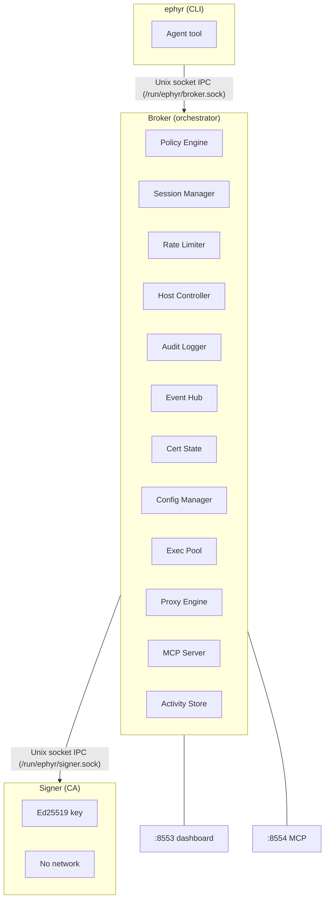
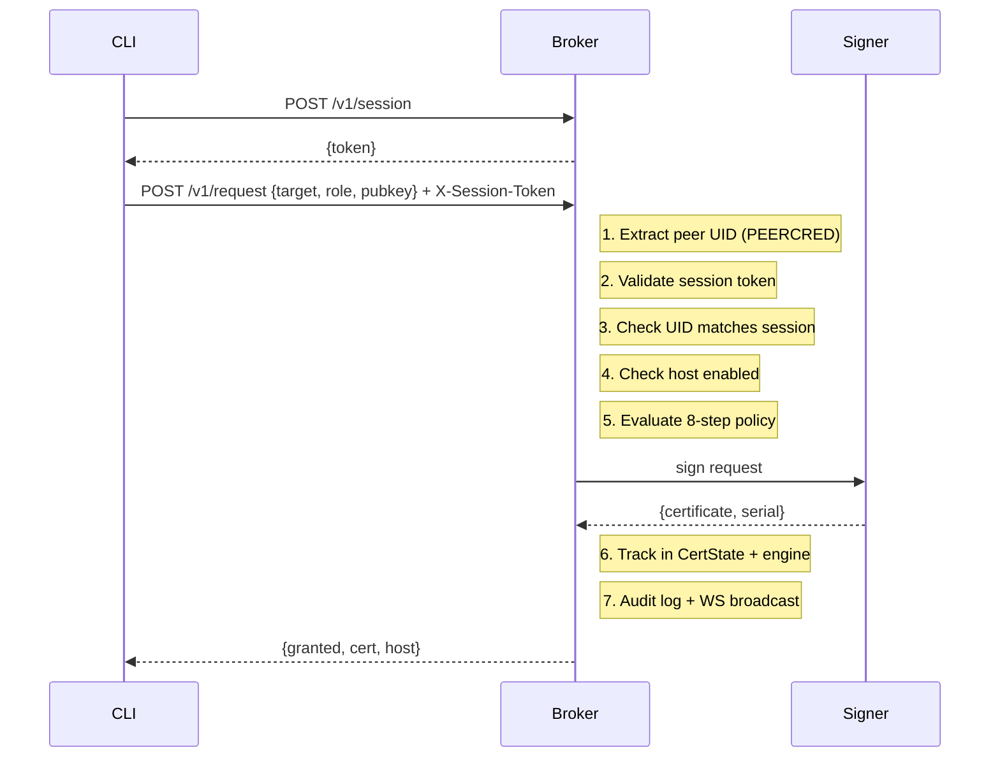
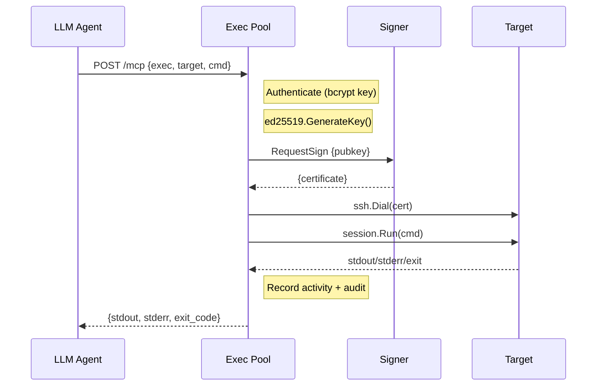
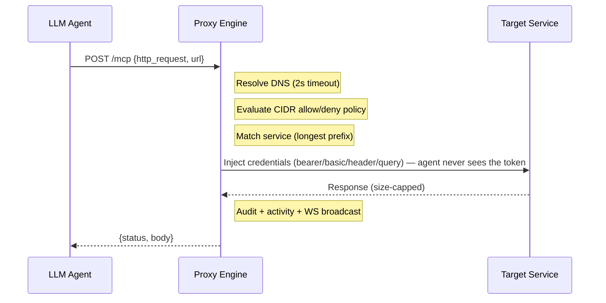
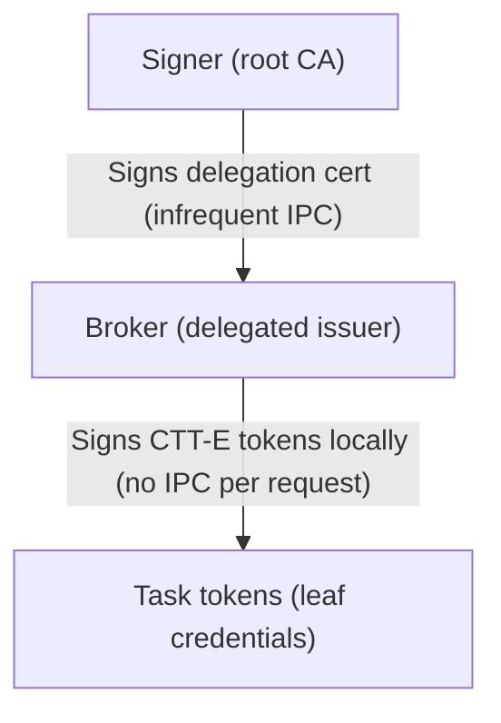

# Ephyr Architecture Deep Dive

## Overview

Ephyr is a three-tier SSH certificate authority designed for privileged access
management in infrastructure environments. It issues short-lived OpenSSH user
certificates to LLM agents, replacing static SSH keys with ephemeral,
policy-governed credentials.

The system is split into three processes -- Signer, Broker, and CLI -- each
running with the minimum privileges required for its function.



<details>
<summary>View as text</summary>

```
+-------------------+       +-------------------------------+       +-------------------+
| ephyr (CLI)       |       | Broker (orchestrator)         |       | Signer (CA)       |
| +-----------+     |       | +-------------+ +-----------+ |       | +-----------+     |
| | Agent tool|     |       | | Policy Eng. | | Session   | |       | | Ed25519   |     |
| +-----------+     |       | | Rate Limiter| | Host Ctrl | |       | |   key     |     |
|                   |       | | Audit Logger| | Event Hub | |       | | No network|     |
|                   |       | | Cert State  | | Config Mgr| |       | +-----------+     |
|                   |       | | Exec Pool   | | Proxy Eng | |       +-------------------+
|                   |       | | MCP Server  | | Activity  | |              ^
+-------------------+       | +-------------+ +-----------+ |              |
         |                  +-------------------------------+              |
         |                       |         |         |                     |
         |  Unix socket IPC     |         |          |  Unix socket IPC   |
         +----- /run/ephyr/broker.sock ---+          +-- /run/ephyr/signer.sock
                                 |                  |
                            :8553 dash         :8554 MCP
```

</details>

---

## The Signer

The signer is the most security-critical component -- sole custodian of the
Ed25519 CA private key, running as an isolated process with zero network access.

### IPC Protocol

Newline-delimited JSON over `/run/ephyr/signer.sock`. Each connection handles
one request-response exchange, then closes (not JSON-RPC 2.0 -- simpler
one-shot protocol).

```json
{"action":"sign","public_key":"ssh-ed25519 AAAA...","principals":["agent-read"],
 "duration":"5m","key_id":"claude@webserver/read","force_command":""}
```

Response: `{"certificate":"<base64>","serial":"a1b2c3d4e5f60718","expires_at":"2026-03-10T14:35:00Z"}`

The `action` field accepts `"sign"` or `"ping"` (health check).

### Peer UID Validation

The signer extracts SO_PEERCRED from every connection. When `EPHYR_BROKER_UID`
is set (999 in production), only the broker process can connect. Unauthorized
UIDs are rejected before any signing occurs.

### CA Key and Certificate Properties

| Property | Value |
|----------|-------|
| Algorithm | Ed25519, key permissions must be exactly 0600 |
| Key ID format | `ephyr:{agent}@{target}/{role}:{serial_hex}` |
| Serial | Cryptographically random 8-byte uint64 |
| Clock skew grace | 30 seconds before `now` |
| Maximum lifetime | 24 hours (hard cap enforced in signer) |
| Extensions | `permit-pty`, `permit-port-forwarding`, `permit-agent-forwarding` |
| Critical options | `force-command` (when target policy defines one) |

### Systemd Sandbox (score: 1.9/10)

| Directive | Effect |
|-----------|--------|
| `ProtectSystem=strict` | Read-only filesystem except explicit paths |
| `MemoryDenyWriteExecute=yes` | Blocks JIT, shellcode injection |
| `RestrictAddressFamilies=AF_UNIX` | Unix sockets only -- no TCP/UDP/raw |
| `CapabilityBoundingSet=` | All Linux capabilities dropped |
| `SystemCallFilter=@system-service` | Allowlisted syscalls only |
| `ReadWritePaths=/run/ephyr` | Only the socket directory is writable |
| `NoNewPrivileges=yes` | Cannot escalate via setuid/setgid |

---

## The Broker

Central orchestrator running multiple listeners and thirteen subsystems.

### Listeners

| Listener | Address | Purpose |
|----------|---------|---------|
| Unix socket | `/run/ephyr/broker.sock` (0660) | CLI/agent API, SO_PEERCRED auth |
| TCP | `:8553` | Dashboard web UI + WebSocket events |
| TCP | `:8554` | MCP server (JSON-RPC 2.0) for LLM agents |

### Components

| Component | Source | Purpose |
|-----------|--------|---------|
| Policy Engine | `policy/engine.go` | 8-step cert request evaluation |
| Session Manager | `auth/session.go` | 256-bit token sessions, one per agent |
| Rate Limiter | `broker/middleware.go` | Per-UID sliding window throttling |
| Audit Logger | `audit/audit.go` | JSON-line structured log with severities |
| Event Hub | `broker/websocket.go` | WebSocket broadcast (64-msg backpressure buffer) |
| Host Controller | `broker/hostctl.go` | Runtime per-host enable/disable |
| Cert State | `broker/state.go` | Active cert and pending request tracking |
| Config Manager | `broker/config.go` | Persistent host config CRUD (JSON) |
| Activity Store | `broker/activity.go` | 10,000-entry ring buffer for analytics |
| Exec Pool | `broker/mcp_exec.go` | SSH session management (persistent + one-shot) |
| Proxy Engine | `broker/proxy.go` | HTTP proxy with credential injection |
| MCP Server | `broker/mcp.go`, `broker/mcp_resources.go` | Model Context Protocol with 15 tools and 7 resources |
| Auth Cache | `broker/mcp_auth.go` | SHA-256-keyed auth result cache with configurable TTL (avoids repeated bcrypt) |

### Certificate Request Flow



<details>
<summary>View as text</summary>

```
CLI                          Broker                         Signer
 |                             |                              |
 |-- POST /v1/session -------->|                              |
 |<---- {token} --------------|                              |
 |                             |                              |
 |-- POST /v1/request ------->|                              |
 |   {target, role, pubkey}    | 1. Extract peer UID          |
 |   + X-Session-Token        | 2. Validate session token    |
 |                             | 3. Check UID matches session |
 |                             | 4. Check host enabled        |
 |                             | 5. Evaluate 8-step policy    |
 |                             |                              |
 |                             |-- sign request ------------->|
 |                             |<-- {certificate, serial} ----|
 |                             |                              |
 |                             | 6. Track in CertState        |
 |                             | 7. Audit log + WS broadcast  |
 |                             |                              |
 |<---- {granted, cert, host} -|                              |
```

</details>

### MCP Command Execution Flow

Ephemeral keypairs generated in-memory (never touch disk):



<details>
<summary>View as text</summary>

```
LLM Agent              Exec Pool              Signer              Target
    |                      |                     |                   |
    |-- POST /mcp -------->|                     |                   |
    |   {exec, target, cmd}| Authenticate        |                   |
    |                      | ed25519.GenerateKey()|                  |
    |                      |                     |                   |
    |                      |-- RequestSign ------>|                   |
    |                      |   {pubkey}          |                   |
    |                      |<-- {certificate} ---|                   |
    |                      |                     |                   |
    |                      |-- ssh.Dial(cert) ------------------>|
    |                      |-- session.Run(cmd) ---------------->|
    |                      |<-- stdout/stderr/exit --------------|
    |                      |                     |                   |
    |                      | Record activity     |                   |
    |                      | + audit             |                   |
    |<-- {stdout, stderr,  |                     |                   |
    |     exit_code} ------|                     |                   |
```

</details>

Persistent sessions (`session_create`) keep the SSH connection open for
multi-command workflows. Idle sessions are cleaned up after 5 minutes.

### HTTP Proxy Flow



<details>
<summary>View as text</summary>

```
LLM Agent              Proxy Engine           Target Service
    |                      |                       |
    |-- POST /mcp -------->|                       |
    |   {http_request, url}| Resolve DNS (2s)      |
    |                      | Evaluate CIDR policy   |
    |                      | Match service (prefix) |
    |                      |                       |
    |                      |-- Inject credentials ->|
    |                      |   (bearer/basic/       |
    |                      |    header/query)       |
    |                      |                       |
    |                      |<-- Response (capped) --|
    |                      |                       |
    |                      | Audit + activity       |
    |                      | + WS broadcast         |
    |                      |                       |
    |<-- {status, body} ---|                       |
```

</details>

### API Routes Summary

**Unix Socket** -- 10 routes: health, session CRUD, cert request/list/revoke,
target listing, approve/deny pending, admin host toggle.

**Dashboard** (`:8553`) -- Mirrors Unix routes plus: summary, hosts, sessions,
audit log, host toggle (revokes certs on disable), host config CRUD, role
listing, WebSocket terminal, activity queries, service config CRUD,
WebSocket event stream.

**MCP** (`:8554`) -- Single `POST /mcp` endpoint. Fifteen tools: `list_targets`,
`exec`, `session_create`, `session_close`, `list_sessions`, `list_certs`,
`http_request`, `list_services`, `list_remotes`, `task_create`, `task_delegate`,
`task_info`, `task_revoke`, `task_list`, plus federated `{server}.{tool}` calls. Seven resources for agent self-discovery:
`ephyr://overview`, `ephyr://targets`, `ephyr://services`,
`ephyr://roles`, `ephyr://status`, `ephyr://tools`, `ephyr://remotes`.

---

## The CLI

Agent-side tool communicating via Unix socket. Handles:
- **Session management:** UID-based auto-detection, token caching, auto-retry
- **Keypair generation:** Ed25519 for certificate signing requests
- **Certificate request:** Submit public key, receive signed cert
- **SSH orchestration:** Connect to targets using received certificates

Session tokens are 256-bit random, one per agent (new session invalidates old).

---

## Design Decisions

**Why three processes?** Principle of least privilege. The signer holds the CA
key with zero network access -- broker compromise cannot extract the key
because the signer socket is UID-restricted via SO_PEERCRED.

**Why Unix sockets?** SO_PEERCRED provides kernel-verified caller identity
(UID/PID/GID) without passwords or shared secrets. Unforgeable from userspace.

**Why no database?** Audit log is append-only JSON lines (jq/SIEM-friendly).
Cert state is in-memory maps with 60-second cleanup. Activity uses a ring
buffer. At this scale, this avoids database operational burden.

**Why ring buffer for activity?** Fixed-size (10,000 entries), O(1) insert,
bounded memory. Oldest entries silently overwritten on wrap.

**Why auto-revoke duplicates?** Agents retry on failure. Keeping stale certs
against concurrency limits creates deadlocks. Step 6 of the pipeline
auto-revokes the old cert for the same agent+target+role.

**Why MCP over REST?** LLMs invoke MCP tools natively with typed arguments
and JSON Schema validation. Streamable HTTP (JSON-RPC 2.0 over POST) is
stateless and proxy-friendly.

---

## Integration Tests

The `test/integration/` directory contains live smoke tests that exercise the
full MCP stack against a running broker instance. These tests verify:

- MCP protocol handshake (`initialize`, `tools/list`)
- Legacy tool compatibility (`list_targets`, `exec`, sessions)
- Complete task lifecycle (`task_create` -> `task_info` -> `task_list` -> `task_revoke`)
- Task validation (rejected TTLs, empty descriptions, nonexistent task IDs)
- Prometheus metrics endpoint (`/v1/metrics`)
- Performance benchmarking (task_create, task_info, task_list, task_revoke latency)

Run them with:

```bash
cd /opt/ephyr
go test ./test/integration/ -v -count=1
```

Override defaults with environment variables:

| Variable | Default | Description |
|----------|---------|-------------|
| EPHYR_MCP_ENDPOINT | http://localhost:8554/mcp | MCP endpoint URL |
| EPHYR_MCP_KEY | (built-in test key) | MCP API key |
| EPHYR_DASH_ENDPOINT | http://localhost:8553 | Dashboard endpoint URL |
| EPHYR_DASH_TOKEN | (your dashboard token) | Dashboard token |

A JSON report is written to `/tmp/ephyr-smoke-report.json` after each run.

---

## Task Identity (v0.2 -- Implemented)

### Tiered Trust Model



<details>
<summary>View as text</summary>

```
+---------------------+
| Signer (root CA)    |
+----------+----------+
           |
           | Signs delegation cert (infrequent IPC)
           v
+---------------------+
| Broker (delegated   |
|        issuer)      |
+----------+----------+
           |
           | Signs CTT-E tokens locally (no IPC per request)
           v
+---------------------+
| Task tokens (leaf   |
|   credentials)      |
+---------------------+
```

</details>

The signer holds the long-lived Ed25519 root key. The broker generates an ephemeral Ed25519 keypair and requests a delegation certificate from the signer. This cert authorizes the broker to sign task tokens (CTT-E) locally without IPC on every request.

### Token Format

CTT-E (Execution Token) is a compact JWT:
- Header: `{"alg":"EdDSA","typ":"CTT-E","kid":"<delegation-cert-id>"}`
- Payload: agent name, task identity (ULID), lineage, capability envelope
- Signature: Ed25519 over `base64url(header).base64url(payload)`

### Validation Chain

Every brokered request with a CTT-E follows:
1. Parse JWT, verify type is CTT-E
2. Look up delegation cert by `kid`, verify against pinned root public key
3. Verify delegation cert hasn't expired
4. Verify CTT-E signature against delegated public key
5. Verify CTT-E hasn't expired
6. Epoch watermark check (walk lineage for revocation)
7. Envelope pre-check (is requested resource within token bounds?)
8. Policy evaluation (existing pipeline)

### Epoch Watermark Revocation

Instead of per-token blocklists, Ephyr uses epoch watermarking. When a task is revoked, its ID is recorded with a timestamp. Any token issued before the watermark is dead. Revoking a parent cascades to all children (their lineage includes the parent ID).

### Capability Envelope

Task tokens carry an upper-bound envelope listing the maximum targets, roles, services, remotes, and methods the task can access. Wildcards in policy are resolved to explicit literal arrays at token issuance time — tokens never contain wildcards.
